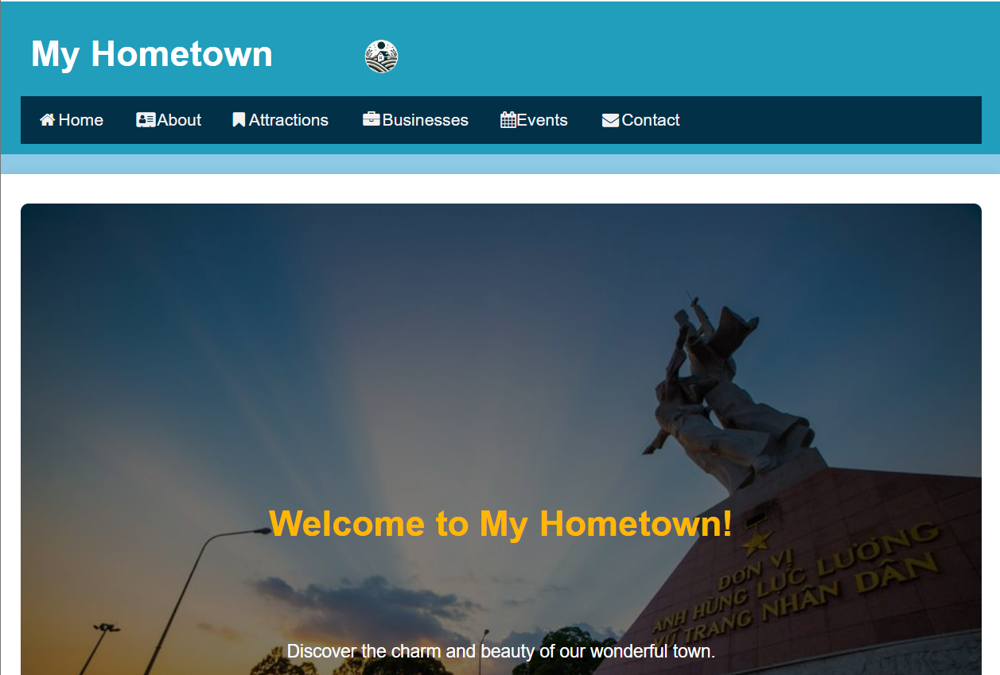
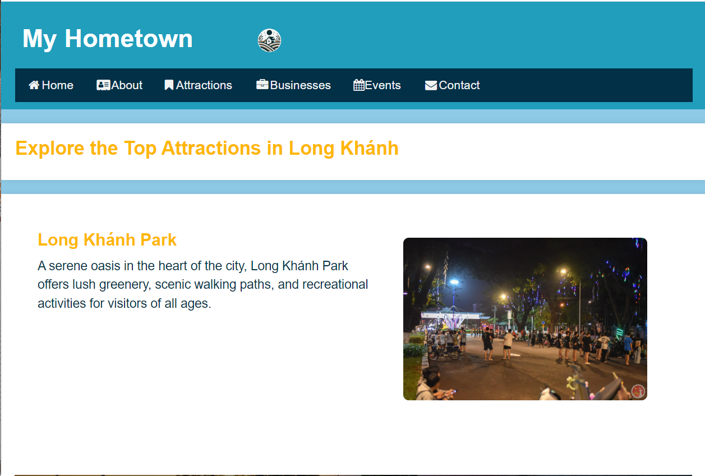
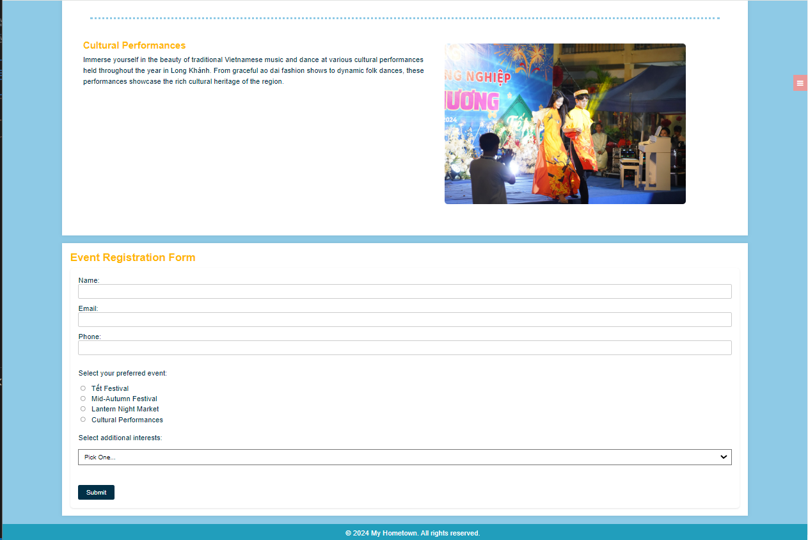

# MyHometownWebsite

MyHometownWebsite is a website dedicated to showcasing the rich history, vibrant culture, and exciting attractions of Long Khánh, a charming town located in Đồng Nai province, Vietnam.

## Table of Contents
1. [About](#about)
2. [Features](#features)
3. [Screenshots](#screenshots)
4. [Installation](#installation)
5. [Usage](#usage)
6. [Contributing](#contributing)

## About
Long Khánh is a picturesque town nestled in the Đồng Nai province of Vietnam. MyHometownWebsite aims to provide visitors with insights into the town's history, culture, landmarks, and businesses, allowing them to explore and appreciate the beauty and charm of Long Khánh.

## Features
- Detailed information about the history and geography of Long Khánh.
- Showcase of notable landmarks, attractions, and events in the town.
- Directory of local businesses, restaurants, and shops.
- Interactive map for exploring key locations in Long Khánh.

## Screenshots
### Home Page

The home page of MyHometownWebsite, featuring a stunning panoramic view of Long Khánh.

### Attractions Page

The attractions page highlighting popular landmarks and points of interest in Long Khánh.

### Businesses Page

The businesses page showcasing local establishments and services available in Long Khánh.

### Events Page

The events page showcasing upcoming events and festivals in Long Khánh.

## Installation
To run MyHometownWebsite locally, follow these steps:
1. Clone the repository: `git clone https://github.com/yourusername/MyHometownWebsite.git`
2. Navigate to the project directory: `cd MyHometownWebsite`
3. Open the `index.html` file in your web browser.

## Usage
Once the website is set up, you can navigate through the different pages to explore information about Long Khánh. Click on the navigation bar to visit specific sections such as attractions, businesses, and events.

You can access the MyHometownWebsite online at [MyHomeTown](https://tuho9428.github.io/MyHomeTown/).

## Contributing
Contributions to MyHometownWebsite are welcome! To contribute:
1. Fork the repository.
2. Create a new branch: `git checkout -b feature-name`
3. Make your changes and commit them: `git commit -m 'Add new feature'`
4. Push to the branch: `git push origin feature-name`
5. Submit a pull request.
